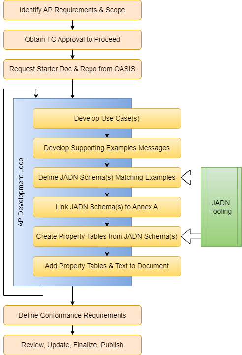

## OASIS Committee Note

-------

# OpenC2 Actuator Profile Development Process Version 1.0

## Committee Note 01

## 03 July 2023

&nbsp;

#### This stage:
https://docs.oasis-open.org/openc2/cn-appdev/v1.0/cn01/cn-appdev-v1.0-cn01.md (Authoritative) \
https://docs.oasis-open.org/openc2/cn-appdev/v1.0/cn01/cn-appdev-v1.0-cn01.html \
https://docs.oasis-open.org/openc2/cn-appdev/v1.0/cn01/cn-appdev-v1.0-cn01.pdf

#### Previous stage:
N/A

#### Latest stage:
https://docs.oasis-open.org/openc2/cn-appdev/v1.0/cn-appdev-v1.0.md (Authoritative) \
https://docs.oasis-open.org/openc2/cn-appdev/v1.0/cn-appdev-v1.0.html \
https://docs.oasis-open.org/openc2/cn-appdev/v1.0/cn-appdev-v1.0.pdf

#### Technical Committee:
[OASIS Open Command and Control (OpenC2) TC](https://www.oasis-open.org/committees/openc2/)

#### Chairs:
Duncan Sparrell (duncan@sfractal.com), [sFractal Consulting LLC](https://www.sfractal.com/) \
Michael Rosa (mjrosa@nsa.gov), [National Security Agency](https://www.nsa.gov/)

#### Editors:
David Lemire (david.lemire@hii-tsd.com), [National Security Agency](http://www.nsa.gov/) \
David Kemp (d.kemp@cyber.nsa.gov), [National Security Agency](https://www.nsa.gov/)

#### Related work:
This document is related to:
* Related specifications (include hyperlink, preferably to HTML format) \
`(remove "Related work" section if no entries)`

#### Abstract:
Open Command and Control (OpenC2) is a concise and extensible language to enable machine-to-machine communications for purposes of command and control of cyber defense components in a manner that is agnostic of the underlying products, technologies, transport mechanisms or other aspects of the implementation. OpenC2 Actuator Profiles (APs) specify the subset of the OpenC2 language relevant in the context of specific actuator functions. A profile refines the meaning of language elements used to perform the actuator function, and often defines additional elements that are relevant and/or unique to that function. This Committee Note describes the TC’s process for using the JSON Abstract Data Notation (JADN) information modeling language in the development of APs, resulting in a rigorous schema for an AP properly integrated with the base OpenC2 language.

#### Status:
This is a Non-Standards Track Work Product. The patent provisions of the OASIS IPR Policy do not apply.

This document was last revised or approved by the OASIS Open Command and Control (OpenC2) TC on the above date. The level of approval is also listed above. Check the "Latest stage" location noted above for possible later revisions of this document. Any other numbered Versions and other technical work produced by the Technical Committee (TC) are listed at https://www.oasis-open.org/committees/tc_home.php?wg_abbrev=openc2#technical.

TC members should send comments on this document to the TC's email list. Others should send comments to the TC's public comment list, after subscribing to it by following the instructions at the "Send A Comment" button on the TC's web page at https://www.oasis-open.org/committees/openc2/.

#### Citation format:
When referencing this document the following citation format should be used:

**[AP-Dev-v1.0]**

_OpenC2 Actuator Profile Development Process Version 1.0_. Edited by David Lemire and David Kemp. 03 July 2023. OASIS Committee Note 01. https://docs.oasis-open.org/openc2/cn-appdev/v1.0/cn01/cn-appdev-v1.0-cn01.html. Latest stage: https://docs.oasis-open.org/openc2/cn-appdev/v1.0/cn-appdev-v1.0.html.

#### Notices
Copyright &copy; OASIS Open 2023. All Rights Reserved.

Distributed under the terms of the OASIS [IPR Policy](https://www.oasis-open.org/policies-guidelines/ipr/).

The name "OASIS" is a trademark of [OASIS](https://www.oasis-open.org/), the owner and developer of this specification, and should be used only to refer to the organization and its official outputs.

For complete copyright information please see the full Notices section in an Appendix below.

-------

# Table of Contents

- [OpenC2 Actuator Profile Development Process Version 1.0](#openc2-actuator-profile-development-process-version-10)
  - [Committee Note 01](#committee-note-01)
  - [03 July 2023](#03-july-2023)
      - [This stage:](#this-stage)
      - [Previous stage:](#previous-stage)
      - [Latest stage:](#latest-stage)
      - [Technical Committee:](#technical-committee)
      - [Chairs:](#chairs)
      - [Editors:](#editors)
      - [Related work:](#related-work)
      - [Abstract:](#abstract)
      - [Status:](#status)
      - [Citation format:](#citation-format)
      - [Notices](#notices)
- [Table of Contents](#table-of-contents)
- [1 Introduction](#1-introduction)
  - [1.1 Purpose](#11-purpose)
  - [1.2 Glossary](#12-glossary)
    - [1.2.1 Definitions of terms](#121-definitions-of-terms)
    - [1.2.2 Acronyms and abbreviations](#122-acronyms-and-abbreviations)
    - [1.2.3 Document conventions](#123-document-conventions)
  - [1.3 Background](#13-background)
    - [1.3.1 Open Command and Control (OpenC2)](#131-open-command-and-control-openc2)
        - [Figure 1-1: OpenC2 Request / Response Paradigm](#figure-1-1-openc2-request--response-paradigm)
    - [1.3.2 JSON Abstract Data Notation (JADN)](#132-json-abstract-data-notation-jadn)
    - [1.3.3 OpenC2 Actuator Profiles](#133-openc2-actuator-profiles)
- [2 AP Development Process Overview](#2-ap-development-process-overview)
  - [2.1 AP Specification Structure](#21-ap-specification-structure)
  - [2.2 Process Steps](#22-process-steps)
        - [**Figure 2-1:  Actuator Profile Development Process**](#figure-2-1--actuator-profile-development-process)
- [3 AP Development Process Walkthrough](#3-ap-development-process-walkthrough)
  - [3.1 AP Development Initiation](#31-ap-development-initiation)
  - [3.2 Develop Use Cases](#32-develop-use-cases)
  - [3.3 Develop Example Messages](#33-develop-example-messages)
  - [3.4 Develop JADN Schema](#34-develop-jadn-schema)
  - [3.5 Link JADN Schema](#35-link-jadn-schema)
  - [3.6 Create Property Tables](#36-create-property-tables)
  - [3.7 Develop Specification Text](#37-develop-specification-text)
  - [3.8 Iterate To Completion](#38-iterate-to-completion)
  - [3.9 Develop Final Example Messages from JADN Schema](#39-develop-final-example-messages-from-jadn-schema)
  - [3.10 Define Conformance Requirements](#310-define-conformance-requirements)
  - [3.11 Review, Approval, and Publication](#311-review-approval-and-publication)
- [Appendix A. Informative References](#appendix-a-informative-references)
          - [\[IM-JADN-v1.0\]](#im-jadn-v10)
          - [\[JADN-v1.0\]](#jadn-v10)
          - [\[OASIS-Names\]](#oasis-names)
          - [\[OASIS-TC-Proc\]](#oasis-tc-proc)
          - [\[OpenC2-Arch-v1.0\]](#openc2-arch-v10)
          - [\[OpenC2-Lang-v1.0\]](#openc2-lang-v10)
          - [\[OpenC2-HTTPS-v1.0\]](#openc2-https-v10)
          - [\[OpenC2-SLPF-v1.0\]](#openc2-slpf-v10)
- [Appendix B. Acknowledgments](#appendix-b-acknowledgments)
  - [B.1 Special Thanks](#b1-special-thanks)
  - [B.2 Participants](#b2-participants)
- [Appendix C. Revision History](#appendix-c-revision-history)
- [Appendix D. Notices](#appendix-d-notices)


-------

<!-- Insert a "line rule" (three or more hyphens alone on a new line, following a blank line) before each major section. This is used to generate a page break in the PDF format. -->

# 1 Introduction

_This document is non-normative in its entirety._

## 1.1 Purpose

This OASIS Committee Note (CN) describes a process for developing
OpenC2 Actuator Profiles (APs), including the use of the JSON
Abstract Data Notation (JADN) information modeling language in
the development of APs. The process described here results in an
AP design and specification that aligns to the relevent use cases
and an associated rigorous JADN schema that binds the AP to the
OpenC2 language.

## 1.2 Glossary

<!-- Optional section with suggested subsections -->

### 1.2.1 Definitions of terms

-   **Action**: The task or activity to be performed (e.g.,
    'deny').

-   **Actuator**: The Consumer that executes the Command.

-   **Actuator Profile**: The document that defines a category of
    operations performed by an Actuator (e.g., 'Stateless Packet
    Filtering').

-   **Argument**: A property of a Command that provides
    additional information on how to perform the Command, such as
    date/time, periodicity, duration, etc.

-   **Command**: A Message defined by an Action-Target pair that
    is sent from a Producer and received by a Consumer.

-   **Consumer**: A managed device / application that receives
    Commands. Note that a single device / application can have
    both Consumer and Producer capabilities.

-   **Information Modeling**: A process to understand and
    document the essential information content relevant to a
    system, application, or protocol exchange without regard to
    how that information is represented in actual
    implementations.

-   **Message**: A content- and transport-independent set of
    elements conveyed between Consumers and Producers.

-   **Producer**: A manager application that sends Commands.

-   **Request**: A Message from a Producer to a Consumer used to
    convey a Command.

-   **Response**: A Message from a Consumer to a Producer
    acknowledging a Command or returning the requested resources
    or status to a previously received Command.

-   **Specifier**: A property or field that identifies a Target
    to some level of precision.

-   **Target**: The object of the Action, i.e., the Action is
    performed on the Target (e.g., IP Address).

### 1.2.2 Acronyms and abbreviations

| Acronym | Description |
|:-------:|--------------|
| AP      | Actuator Profile |
| IM      | Information Modeling
| JADN    | JSON Object Data Notation |
| JSON    | JavaScript Object Notation |
| LS      | Language Specification | 
| OASIS   | Organization for the Advancement of Structured Information Standards |
| OpenC2  | Open Command and Control |
| TC      | Technical Committee |
| UML     | Unified Modeling Language |

### 1.2.3 Document conventions

- Naming conventions
- Font colors and styles
- Typographic conventions

## 1.3 Background

This section provides background information on OpenC2, JADN, and
the role of actuator profiles (APs) to provide a context for the
process described in sections 2 and 3.

### 1.3.1 Open Command and Control (OpenC2)

OpenC2 is a suite of specifications that enables command and
control of cyber defense systems and components. OpenC2 typically
uses a request-response paradigm where a _Command_ is encoded by
a _Producer_ (managing application) and transferred to a
_Consumer_ (managed device or virtualized function) using a
secure transfer protocol, and the Consumer can respond with
status and any requested information. This request / response
paradigm is illustrated in Figure 1-1.

##### Figure 1-1: OpenC2 Request / Response Paradigm


OpenC2 allows the application producing the commands to discover
the set of capabilities supported by the managed devices (i.e.,
an introspection capability). This capability permits the
managing application to adjust its behavior to take advantage of
the features exposed by the managed device. The capability
definitions can be easily extended in a noncentralized manner,
allowing standard and non-standard capabilities to be defined
with semantic and syntactic rigor.

OpenC2's approach to automating cybersecurity command and control is described
in the *OpenC2 Architecture Specification*
[[OpenC2-Arch-v1.0](#openc2-arch-v10)]. The specifics of the OpenC2 language are
defined in the *OpenC2 Language Specification* [[OpenC2-Lang-v1.0](#openc2-lang-v10)].

### 1.3.2 JSON Abstract Data Notation (JADN)

JSON Abstract Data Notation (JADN) is a UML-based information modeling language
that defines data structure independently of data format. Information models are
used to define and generate physical data models, validate information
instances, and enable lossless translation across data formats. A JADN
specification consists of two parts: type definitions that comprise the
information model, and serialization rules that define how information instances
are represented as data. The information model is itself an information instance
that can be serialized and transferred between applications. The model is
documented using a compact and expressive interface definition language,
property tables, or entity relationship diagrams, easing integration with
existing design processes and architecture tools.

The OpenC2 TC has published a *JADN Specification*  [[JADN-v1.0](#jadn-v10)],
and a companion CN describing the use of JADN in Information Modeling (IM)
[[IM-JADN-v1.0](#im-jadn-v10)].

### 1.3.3 OpenC2 Actuator Profiles

As described in the *OpenC2 Architecture Specification*, APs
serve the purpose of scoping the general purpose OpenC2 language
to the C2 of a particular cyberdefense function:  

> OpenC2 Actuator Profiles specify the subset of the OpenC2
> language relevant in the context of specific actuator
> functions. Cyber defense components, devices, systems and/or
> instances may (in fact are likely to) implement multiple
> profiles. A profile refines the meaning of language elements
> (actions, targets, command arguments, results) used to perform
> the actuator function, and often defines additional elements
> that are relevant and/or unique to that function.

The goal of this CN is to document a well-formed approach to
developing APs that takes advantage of the rigor provided by
applying JADN information modeling to the process.

-------

# 2 AP Development Process Overview

This section describes the standard structure of an OpenC2 AP and provides an
overview of the development process that will be detailed in 
[Section 3](#3-ap-development-process-walkthrough).

## 2.1 AP Specification Structure

OpenC2 APs employ a common structure to ensure consistent inclusion of the
essential content.  As APs are published as OASIS Specifications, the structure
also incorporates standard document elements defined by OASIS. As specified in
the *OpenC2 Language Specification*, an AP *may* extend the OpenC2 language by
defining extension targets, arguments, and specifiers needed to support the
function the AP is addressing, but *may not* define actions beyond those
contained in the LS.

The focus of the process described in this CN is to identify and refine the
specific actions, targets, arguments, specifiers, and supporting data types
needed for the AP, to illustrate their use with example message content, and to
formally define that in a schema using the JADN information modeling language.

 * Body
   * 1: Introduction (including Glossary, Acronyms and Abbreviation, Overview,
     Purpose and Scope)
   * 2: OpenC2 Language Binding 
     * 2.1: OpenC2 Command Components
       * 2.1.1: Actions -- identifies the actions relevant for this AP
       * 2.1.2: Targets -- identifies the targets relevant for this AP,
         including extension targets
       * 2.1.3: Type Definitions -- identifies extension types relevant for this
         AP targets
       * 2.1.4: Command Arguments
       * 2.1.5: Actuator Specifiers
     * 2.2: OpenC2 Response Components
     * 2.3: OpenC2 Commands -- defines the valid Action / Target pairs for this AP
       * 2.3.x -- describes each valid command and the expected behavior
   * 3: Conformance -- defines requirements for claiming conformance to this AP
 * Annex A: JADN Schema -- identifies the JADN schema files defining the
   normative schema for this AP. The schema file(s) are normative, per OASIS
   conventions, and take precedence over the text in the AP specification. The
   schema(s) are linked in an _Annex_ to support potential adoption of the AP as
   an ITO-T Recommendation (Annexes are normative in ITU-T Recommendations,
   Appendices are non-normative).
 * Appendices
   * Appendix A: References
   * Appendix B: Safety, Security, and Privacy Considerations
   * Appendix C: Acknowledgements
   * Appendix D: Revision History
   * Appendix E: Message Examples
   * Appendix F: Notices
 * Associated schema files (packaged separately, linked from Annex A)


## 2.2 Process Steps

Figure 2-1 illustrates a process for the development of an Actuator Profile (AP)
based on defining use cases, prototopying messages, and formalizing that
material in a JADN information model. The process assumes a degree of iteration
toward completion and its execution does not need to be strictly linear.

> Note: inital draft graphic, to be refined as document develops

##### **Figure 2-1:  Actuator Profile Development Process**


 1. **AP Development Initiation:** Identify the need, define the scope, receive
    TC approval, request a starter document, establish a work environment.
 2. **Develop AP Content:** a development loop for creating the AP,
 
    A) **Develop Use Cases:** Identify use case(s) for control of cyber defense
       function for the AP.

    B) **Develop Example Messages:** Develop example messages to implement the
       defined use case(s), and capture in the Examples appendix.
    
    C) **Develop JADN Schema:** Develop the JADN information model specifying
       the types needed to create and validate the example messages.
    
    D) **Link JADN Schema:**  Link to the JADN schema file(s) from Annex A.

    E) **Create Property Tables:** Use JADN tooling to generate property tables
       from the JADN schema.

    F) **Insert Property Tables and Associated Text:** Add the property tables
       for the schema to the body of the AP specification, and develop
       corresponding text content.
 3. **Interate To Completion:** As the AP matures the initial use case(s) can be
    refined and additional use cases can be defined and integrated as described
    in Step 2.
 4.  **Develop Final Example Messages from JADN Schema:** The example message
     content included in the AP should be finalized based on the JADN schema to
     ensure the messages are valid and conform to the schema.
 5.  **Define Conformance Requirements:** All OASIS specifications are required
     to include [conformance requirements](https://docs.oasis-open.org/templates/TCHandbook/ConformanceGuidelines.html). 
 6.  **Review, Approval, and Publication:** All OASIS specifications are
     required to follow the standard approval process, including [public
     review](https://www.oasis-open.org/policies-guidelines/tc-process-2017-05-26/#publicReview)
     prior to [final TC
     approval](https://www.oasis-open.org/policies-guidelines/tc-process-2017-05-26/#committeeSpec).


-------

# 3 AP Development Process Walkthrough

## 3.1 AP Development Initiation

The OpenC2 TC follows OASIS processes for the initiation of new work items. 
The details of the TC's process are captured in 
[Section 4 of the TC's _Documentation Norms_](https://github.com/oasis-tcs/openc2-tc-ops/blob/main/Documentation-Norms.md#4-openc2-tc-work-product-development-process). 

## 3.2 Develop Use Cases

A primary activity in developing an AP is to identify the cyber defense
function(s) to be invoked and document the specifics. Use cases are employed to
structure this information. An OpenC2 AP use case will typically describe the
following:

 - The **OpenC2 Request** (i.e., command)
   - The Actuator function to be invoked
   - The OpenC2 Action employed to invoke the functions
   - The Target of the Action
     - A Target can be selected from the targets defined in the _OpenC2 Language
       Specification_
     - OpenC2 APs can define AP-specific Targets as extensions if a suitable
       target does not exist in the base set
    - Additional parameters needed for the command
      - Parameters can be selected from those defined in the _OpenC2 Language
        Specification_
      - OpenC2 APs can define AP-specific data types as extensions in order to
        enumerate all of the information necessary to completely define the
        meaning and scope of the command 
 - The **Actuator Behavior** describing the activities to be performed by the
   Actuator on receipt of the Request and the information expected to be
   returned
 - The **OpenC2 Response**
   - The data types and structures appropriate for responding to this Request
      - Data types can be selected from those defined in the _OpenC2 Language
        Specification_
      - OpenC2 APs can define AP-specific data types as extensions in order to
        enumerate all of the information necessary to completely define the
        information to be returned in the response 

Use case development often uncovers unanticipated needs for additional functions
or information types. The quantity of use cases needed for an AP varies with the
complexity of the Actuator being profiled.


## 3.3 Develop Example Messages

Each use case should be supported by one or more Request / Response pairs that
illustrate the message content needed to carry out the use case. Depending on
the level of flexbility allowed by parameters defined for the Request and range
of data types potentially returned in a Reponse, multiple Request / Response
pairs may be needed to fully explore the implementation of a use case.

To provide specificity, example messages should be written out completely. This
is typically done by writing JSON code for each Request and the associated
Response, providing example values for the parameters and return data. As with
use cases, the development of example messages often uncovers unanticipated
needs for additional functions or information types, or may lead to the
identification of additional use cases.

## 3.4 Develop JADN Schema

Describing use cases and then developing example messages to implement them are
steps toward documenting the actuator interactions with increasing precision.
Developing a JADN schema for the example messages represents the next step in
specificity, defining the information model specifying the content of acuator
requests and responses in precise terms, using a well-defined set of information
types.

As a simple example, consider developing an initial use case for an actuator
profile for IP packet filtering. At the use case level, an example use case
might state: "the packet filter needs to be able to block traffic from a
collection of network addresses specified as a CIDR block."

To develop example messages, the dimensions of the use case need to be defined
in more specific terms:

 - What is the OpenC2 Action appropriate for blocking traffic?
 - What OpenC2 Target is used to specify a CIDR block?
 - What is the OpenC2 syntax for describing a CIDR block?
 - Should the ability to block include both IPv4 and IPv6 addresses?

Reviewing the needs defined in the use case against the *OpenC2 Language
Specification* provides specifics that help in creating example messages:

 - The `deny` Action is appropriate for blocking IP traffic
 - The `ipv4_net` and `ipv6_net` Targets are used to specify CIDR blocks

With the information from the Language Specification, the formulation of an
example command in JSON syntax is straightforward:

> NOTE: confirm that the syntax in this example is correct; should the IPv4-Net
> array use square brackets? `[...]` 

```json
{
    "action": "deny",
    "target": {
        "ipv4_net": {"1.2.3.0", 24}
    },
}
```

Having defined the command, the next step is to consider the possible responses
from the actuator: what are the success and failure possibilities in response to
this `deny` command? What information should the actuator provide back to the
command Producer? The OpenC2 response message provides for a numeric status code
(based on the HTTP response code set), an optional human-readable status
message, and an optional results field that, if used, needs to be defined in the
actuator profile. For this command, a success or failure indication can be
provided using the status code and, perhaps, explanatory information regarding a
failure could be defined for the status message. Since it is typical for packet
filters to apply rules based on some priority order, a useful return value might
be the rule number assigned to the new `deny` setting. This might lead, in turn,
to additional use cases, such as the removal of a rule by specfying its number.

Finally, the JADN information model to support the content developed in the
example messages should be documented. In this case, the majority of the model
is simply a subset of the *OpenC2 Language Specification*'s JADN model, but an
additional data type must be defined for the rule number information in the
response message.

> NOTE: insert JADN content here for basic message example

## 3.5 Link JADN Schema

> NOTE: need to look at emails from TC-ADMIN with some guidance details on
> naming, linking, namespaces, ets.

The JADN Schema is a formal part of the AP and the normative definition of the
associated data types and structures. As discussed in [Section
2.1](#21-ap-specification-structure) Annex A is used to establish the linkage
between the AP specification document and the JADN schema file(s). Per OASIS TC
Procedures:

 * All normative  definitions must also be provided in separate plain text
   files;  
 * Each text file must be referenced from the Work Product; and
 * Where any definition in these separate files disagrees with the definition
   found in the specification documentation, the definition in the separate file
   prevails.

 ([[OASIS-TC-Proc](#oasis-tc-proc)], Section 2.2.5).

 All JADN files that are part of the schema must be named in accordance with
 OASIS naming conventions ([OASIS-Names](#oasis-names)), identified in the front
 matter under Additional Artifacts and Declared JADN Namespaces, listed in
 Annex A of the AP specification, and included in the package of files for the
 AP when submitted to OASIS for approval or publication.

 The OpenC2 convention for APs is to identify the JADN schema (i.e., the JSON
 data representation in a separate file) as the normative schema, and present
 the JIDL version in an Appendix to provide a readily human-readable
 presentaiton of the schema in the AP specification document.

## 3.6 Create Property Tables

To create readable, structured documentation of the types defined for the
profile, the JADN schema is processed via automated tooling to create a property
tables representation. These tables are integrated into Sections 2.1 and 2.2 of
the AP document to identify the various data structures and types used in the
profile. As described in section 3.1.4 of
[[OpenC2-Lang-v1.0](#openc2-lang-v10)], the specification of extensions in an AP
to fit the needs of a particular cyberdefense function are anticipated and
supported by the OpenC2 language. These extensions are defined in the profile's
JADN schema and documented in the specification using property tables.

The fields of a property table vary with the needs of the data type being
described but will include an appropriate subset of the following:

 * **ID:** an integer identifier for a field in a compound type
 * **Name:** the name of the type or field being defined
 * **Type:** the data type for the type or field being defined
 * **#:** a field to define the cardinality requirements of type or field being
   defined
 * **Description:** a description of the purpose of the type or field being
   defined

All of these fields are normative except for the `Description` field and their
meanings are as defined in the [[JADN-v1.0](#jadn-v10)] specification.

## 3.7 Develop Specification Text 

Descriptive text is needed to complement the JADN schema and property tables.
The text should provide details (e.g., usage requirements) regarding the
extensions defined in the AP. Section 2.3.x should walk through the commands
defined in the profile, describing the expected processing associated with each
command and any specific requirements associated with Responses to particular
commands. This content is typically organized to present each OpenC2 Action
included in the profile and discuss the handling of each valid target for that
action.

## 3.8 Iterate To Completion

The development of a profile is typically iterative as additional use cases and
revised or additional data types are uncovered. This is also consistent with the
TC's ["Agile" document development
concept](https://github.com/oasis-tcs/openc2-tc-ops/blob/main/Documentation-Norms.md#32-agile-document-development-concept)
under which content is developed over time, with frequent publication of
[Committee Specification Drafts
(CSDs)](https://www.oasis-open.org/policies-guidelines/tc-process-2017-05-26/#committeeDraft)
to codify and document TC acceptance of content developed to-date.

## 3.9 Develop Final Example Messages from JADN Schema

As described in [Section 3.3](#33-develop-example-messages), developing example
OpenC2 Command and Response messages is a useful technique for clarifying the
capabilities needed for the profile. Example messages often identify types
needed, which are then codified in the profile's JADN schema. It is common as
the profile content evolves that changes are made to the schema such that the
example messages developed earlier in the process may no longer align with the
schema. To ensure consistency those examples should be validated against the
final schema version and, if necessary, updated example messages produced that
are consistent with the final schema.

## 3.10 Define Conformance Requirements

## 3.11 Review, Approval, and Publication


-------

# Appendix A. Informative References

<!-- Required section -->

This appendix contains the informative references that are used in this document.

While any hyperlinks included in this appendix were valid at the time of publication, OASIS cannot guarantee their long-term validity.

(Reference sources:
For references to IETF RFCs, use the approved citation formats at: \
https://docs.oasis-open.org/templates/ietf-rfc-list/ietf-rfc-list.html. \
For references to W3C Recommendations, use the approved citation formats at: \
https://docs.oasis-open.org/templates/w3c-recommendations-list/w3c-recommendations-list.html. \
Remove this note before submitting for publication.)

###### [IM-JADN-v1.0]

_Information Modeling with JADN Version 1.0_. Edited by David Kemp. 19 April
2023. OASIS Committee Note 01.
https://docs.oasis-open.org/openc2/imjadn/v1.0/cn01/imjadn-v1.0-cn01.html.
Latest stage: https://docs.oasis-open.org/openc2/imjadn/v1.0/imjadn-v1.0.html.

###### [JADN-v1.0]
_JSON Abstract Data Notation Version 1.0_. Edited by David Kemp. 17 August 2021.
OASIS Committee Specification 01.
https://docs.oasis-open.org/openc2/jadn/v1.0/cs01/jadn-v1.0-cs01.html. Latest
stage: https://docs.oasis-open.org/openc2/jadn/v1.0/jadn-v1.0.html.

###### [OASIS-Names]
_OASIS Naming Directives_, 13 February 2020,
https://docs.oasis-open.org/specGuidelines/ndr/namingDirectives.html

###### [OASIS-TC-Proc]
_Technical Committee Process_, 01 December 2020,
https://www.oasis-open.org/policies-guidelines/tc-process-2017-05-26/

###### [OpenC2-Arch-v1.0]
_Open Command and Control (OpenC2) Architecture Specification Version 1.0_.
Edited by Duncan Sparrell. 30 September 2022. OASIS Committee Specification 01.
https://docs.oasis-open.org/openc2/oc2arch/v1.0/cs01/oc2arch-v1.0-cs01.html.
Latest stage: https://docs.oasis-open.org/openc2/oc2arch/v1.0/oc2arch-v1.0.html.

###### [OpenC2-Lang-v1.0]

_Open Command and Control (OpenC2) Language Specification Version 1.0_. Edited
by Jason Romano and Duncan Sparrell. 24 November 2019. OASIS Committee
Specification 02.
https://docs.oasis-open.org/openc2/oc2ls/v1.0/cs02/oc2ls-v1.0-cs02.html. Latest
version: https://docs.oasis-open.org/openc2/oc2ls/v1.0/oc2ls-v1.0.html.

###### [OpenC2-HTTPS-v1.0]
_Specification for Transfer of OpenC2 Messages via HTTPS Version 1.0_. Edited by
David Lemire. Latest stage:
http://docs.oasis-open.org/openc2/open-impl-https/v1.0/open-impl-https-v1.0.html

###### [OpenC2-SLPF-v1.0]
_Open Command and Control (OpenC2) Profile for Stateless Packet Filtering
Version 1.0_. Edited by Joe Brule, Duncan Sparrell, and Alex Everett. Latest
stage: http://docs.oasis-open.org/openc2/oc2slpf/v1.0/oc2slpf-v1.0.html


-------

# Appendix B. Acknowledgments

(Note: A Work Product approved by the TC must include a list of people who participated in the development of the Work Product. This is generally done by collecting the list of names in this appendix. This list shall be initially compiled by the Chair, and any Member of the TC may add or remove their names from the list by request.  
Remove this note before submitting for publication.)

## B.1 Special Thanks

<!-- This is an optional subsection to call out contributions from TC members. If a TC wants to thank non-TC members then they should avoid using the term "contribution" and instead thank them for their "expertise" or "assistance". -->

Substantial contributions to this document from the following individuals are gratefully acknowledged:

Participant Name, Affiliation or "Individual Member"

## B.2 Participants

<!-- A TC can determine who they list here, however, TC Observers must not be listed. It is common practice for TCs to list everyone that was part of the TC during the creation of the document, but this is ultimately a TC decision on who they want to list and not list, and in what order. -->

The following individuals have participated in the creation of this document and are gratefully acknowledged:

** OASIS Open Command and Control (OpenC2) TC Members:**

| First Name | Last Name | Company |
| :--- | :--- | :--- |
Philippe | Alcon | Marvelous Networks
Alex | Amir | Viacat
Kris | Anders | Trend Mission
Darren | Anysteel | Macro Networks

-------

# Appendix C. Revision History
| Revision | Date | Editor | Changes Made |
| :--- | :--- | :--- | :--- |
| filename-v1.0-wd01 | yyyy-mm-dd | Editor Name | Initial working draft |

------

# Appendix D. Notices

Copyright &copy; OASIS Open 2023. All Rights Reserved.

All capitalized terms in the following text have the meanings assigned to them in the OASIS Intellectual Property Rights Policy (the "OASIS IPR Policy"). The full [Policy](https://www.oasis-open.org/policies-guidelines/ipr/) may be found at the OASIS website.

This document and translations of it may be copied and furnished to others, and derivative works that comment on or otherwise explain it or assist in its implementation may be prepared, copied, published, and distributed, in whole or in part, without restriction of any kind, provided that the above copyright notice and this section are included on all such copies and derivative works. However, this document itself may not be modified in any way, including by removing the copyright notice or references to OASIS, except as needed for the purpose of developing any document or deliverable produced by an OASIS Technical Committee (in which case the rules applicable to copyrights, as set forth in the OASIS IPR Policy, must be followed) or as required to translate it into languages other than English.

The limited permissions granted above are perpetual and will not be revoked by OASIS or its successors or assigns.

This document and the information contained herein is provided on an "AS IS" basis and OASIS DISCLAIMS ALL WARRANTIES, EXPRESS OR IMPLIED, INCLUDING BUT NOT LIMITED TO ANY WARRANTY THAT THE USE OF THE INFORMATION HEREIN WILL NOT INFRINGE ANY OWNERSHIP RIGHTS OR ANY IMPLIED WARRANTIES OF MERCHANTABILITY OR FITNESS FOR A PARTICULAR PURPOSE.

The name "OASIS" is a trademark of [OASIS](https://www.oasis-open.org/), the owner and developer of this specification, and should be used only to refer to the organization and its official outputs. OASIS welcomes reference to, and implementation and use of, specifications, while reserving the right to enforce its marks against misleading uses. Please see https://www.oasis-open.org/policies-guidelines/trademark/ for above guidance.
